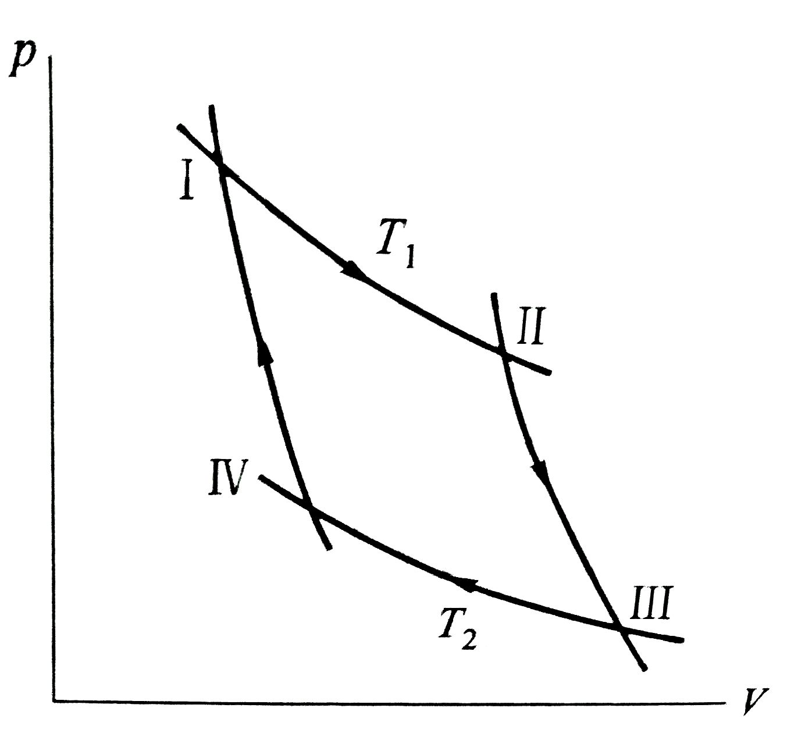

# Chapter 1
Author:[Wang-ZhengYi](https://github.com/Wang-ZhengYi)
## Thermodynamics basic laws
### 1st Objets descriptions
#### thermodynamics systems:
consists of planty of microscopic particles
	. outexternal system
substancses that interact with the systems

|systems|isolated|closed|open|
|:---:|:---:|:---:|:---:|
|__Materical exchange__|\xmark|0|1|
|__power exchange__|0|1|1|

#### Equilibrium state 
1. **therom-dynamics equilibrium**  
	flow stops, particle thermal motion
2. **fluctuation**
3. **Equilibrium state of non isolated system**

#### Descriptions of Equb.
. **State functions**:macroscopics quantities for statical parameters.  

. **Dynamic parameters**:Pressure:P  

. **Geometric Parameters**:Volume:V  

. **Electricmagnetical Paramters**:Intesities  

. **Chemical Parameters**:Chemical potential,moles	 

#### non Equb.
**The phase**  
	materical with uniform physical and chemical properties is a phase
1. **Homogeneous system**
	one **phase**  
	**Intensitive quangtity and Extensive quantity**
	**I.Q.**:P,T,partial non relate to total mass
	**E.Q.** M,V
	**system division**:IQ are the same, EQ are countable
2. **Multiphase system**
	more than one phase
3. **Meta**
	a chemical component is a meta

----
### The zeroth law of thermodynamics(the law of Thermal Equilibrium)		
<table><tr><td bgcolor=orange>***When two bodies are in thermal equilibrium with a third body at the same time, the two bodies must also be in thermal equilibrium with each other***</td></tr></table> 
**Tempertaure**:the intensity of particles thermal motions

#### State quations

$$
pV = nRT
$$

***Differential forms:***

$$
d P = \left( \frac { \partial P } { \partial V } \right) _ { T } d V + \left( \frac { \partial P } { \partial T } \right) _ { V } d T
$$

$$
d V = \left( \frac { \partial V } { \partial P } \right) _ { T } d P + \left( \frac { \partial V } { \partial T } \right) _ { P } d T
$$

$$
\left( \frac { \partial V } { \partial P } \right) _ { T } \left( \frac { \partial P } { \partial T } \right) _ { V } \left( \frac { \partial T } { \partial V } \right) _ { P } = - 1
$$

**simple soild and liquid:**  

$$
\frac { d V } { V } = \alpha d T - K _ { T } d P
$$

**Paramagnetic soild**  

$$
m = \frac { C } { T } H
$$

----
### The first law of thermodynamics
**Conservation of energy**  

1. Relaxtion time  

$$
\tau \\ the \\ time \\ of \\ non-Equilibrium \\ \Rightarrow Equilibrium
$$

2. Quasi static process  
	The process is very slow, and every state the system experiences in the process of change can be regarded as a static equilibrium state.  
3. Doing work  
**Fluid**:  

$$
W = - \int _ { V _ { A } } ^ { V _ { B } } p d V
$$

**Surface**
$$
\bar{d} w = \sigma d A
$$

**Dielectric**
$$
\bar{d} w = \varepsilon V d \rho
$$

#### internal energy

1. **Two forms of internal energy exchange**  
	1. Work 
	2. Heat exchange  

2. **Adiabatic process**
	
3. **Internal energy ** 

*Equation of the first law of thermodynamics*

$$
\mathrm{U_{b}}-\mathrm{U_{a}}=\mathrm{Q}+\mathrm{W}
$$

$$
 d U=\bar {d} Q+\bar {d} w
$$

$$
d U=\delta Q+\delta W=\delta Q-p_{\mathrm{amb}} \mathrm{d} V+\delta W^{\prime}
$$
$$W^{\prime} is Non volume work  $$ 

U is an extension can be added linearly  

W  and  Q  are  Process  quantities

#### Heat capacity and enthalpy
1. The heat absorbed by the system by raising the unit temperature in a certain process is the heat capacity of the system

	$$
	C=(\lim ) \frac{\Delta Q}{\Delta T}
	$$

	1. Heat capacity depends on material property and process  
	2. Heat capacity is an extension

#### Isometric heat capacity

$$
C_{V}=\left(\frac{\partial U}{\partial T}\right)_{V}
$$

#### Isobaric heat capacity

$$
C_{p}=\left( \frac{\partial U} {\partial T} \right) _{p} + p \left( \frac{\partial V} {\partial T} \right) _{p}
$$

$$
\Delta H=H_{2}-H_{1}=\left(U_{2}+p_{2} V_{2}\right)-\left(U_{1}+p_{1} V_{1}\right)
$$

$$
C_{p}=\left( \frac{\partial H} {\partial T} \right) _{p}
$$

|systems|isolated|closed|open|
|:---:|:---:|:---:|:---:|
|__Materical exchange__|0|0|1|
|__power exchange__|0|1|1|

#### Joule experiment, Joule coefficient
<table><tr><td bgcolor=magenta>***T and V are independent variables and internal energy is a function of T and V***</td></tr></table>

1. **Joule experiment**

$$
\left(\frac{\partial T}{\partial V}\right)_{U}=0
$$

2. **Joule coefficient**

$$
\left(\frac{\partial T}{\partial V}\right)_{U}
$$

#### ideal gas

1. **Heat capacity**
	$$
	C_{V}=\frac{n R}{\gamma-1}
	$$
<!-- 	$$
	\frac{\partial T}{\partial V}=\frac{\partial T}{\partial V}
	$$ -->
2. **Equation of reversible adiabatic process of ideal gas**  
	$$
	p V^{\gamma}=Const.
	$$
	$$
	\left( \frac{T_{2}}{T_{1}} \right)^{C_{V,m}} \left( \frac{V_{2}}{V_{1}} \right)^{R}=1
	$$
	$$
	\left( \frac{T_{2}}{T_{1}} \right)^{C_{p,m}} \left( \frac{p_{2}}{p_{1}} \right)^{-R}=1
	$$
	$$
	\left( \frac{p_{2}}{p_{1}} \right) \left( \frac{V_{2}}{V_{1}} \right)^{\gamma}=1
	$$
3. **Standard molar reaction enthalpy**
	$$
	\Delta _{r} H^{\theta} _{m}
	$$

----
### The second law of thermodynamics
1. **Kano cycle**

	
	
	$$
	W = -RT_{1} \ln \frac{V_1}{V_2}
	$$
	**Effection:**
	$$
	\eta =\frac{-W}{Q_{1}}= \frac{Q_{1}+Q_{2}}{Q_{1}} = \frac{T_{1}-T_{2}}{T_{1}}
	$$

	1. **Kamo laws**  
		$$
		\frac{Q_{1}}{T_{1}}+\frac{Q_{2}}{T_{2}}  
		\begin{cases}
		=0& \text{Reversible cycle}\\\\
		>0& \text{Irreversible cycle}
		\end{cases}
		$$
2. **Entropy**
	$$
	d S=\frac{\delta Q_{r}}{T}
	$$

3. **Clausius inequality**
		$$
		d S 
		\begin{cases}
		=\frac{\delta Q}{T}& \text{Reversible cycle}\\\\
		>\frac{\delta Q}{T}& \text{Irreversible cycle}
		\end{cases}
		$$

----
### Entopy,Free Energy,Gibbs Function:

1. **Kamo laws**  
		$$
		\frac{Q_{1}}{T_{1}}+\frac{Q_{2}}{T_{2}}  
		\begin{cases}
		=0& \text{Reversible cycle}\\\\
		>0& \text{Irreversible cycle}
		\end{cases}
		$$

2. **Clausius inequality**
		$$
		d S 
		\begin{cases}
		=\frac{\delta Q}{T}& \text{Reversible cycle}\\\\
		>\frac{\delta Q}{T}& \text{Irreversible cycle}
		\end{cases}
		$$

3. **Entropy**
	$$
	d S=\frac{\delta Q_{r}}{T}
	$$

----
### ???

----
### *Homework*
<table><tr><td bgcolor=skyblue>***1.1,1.2,1.5***</td></tr></table> 

